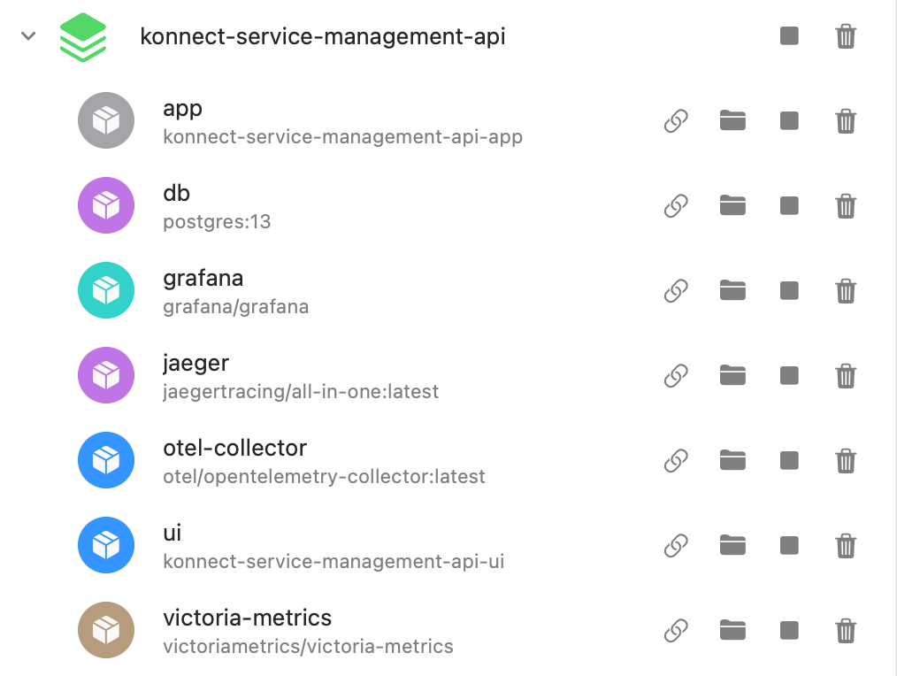
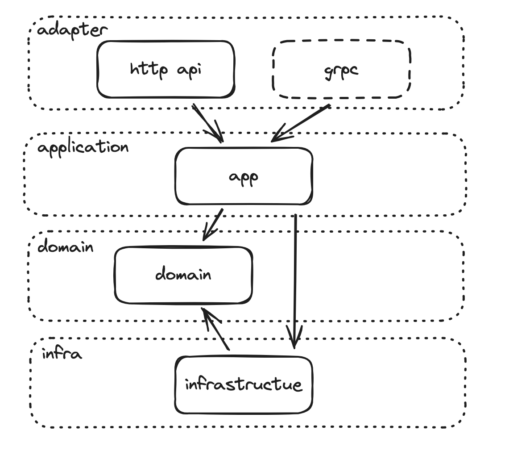
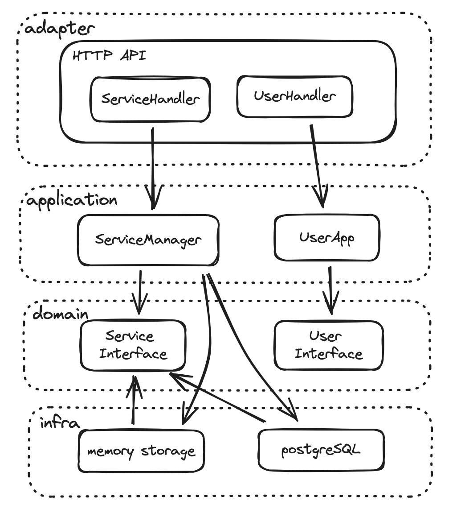
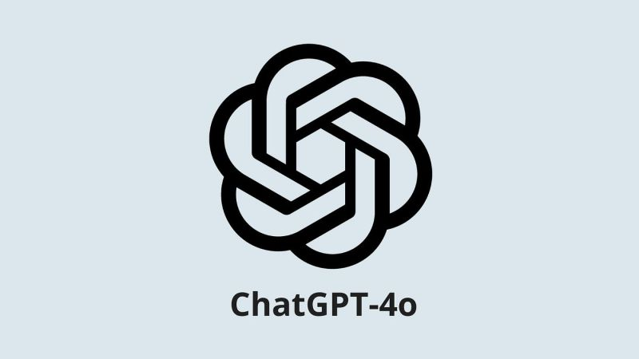

# Service Catalog Demo

* [English](README.md)
* [简体中文](README_zh-CN.md)

<a href="https://asciinema.org/a/CATqU6FRQWSHzVb6L193EoKTR" target="_blank"></a>

https://github.com/daymade/catalog-service-management-api/assets/4291901/7ecb4d40-935f-4f2a-9c41-2d376f62d5b8

Service Catalog Demo 是一个微服务 API 管理平台，用户可以在前端 Dashboard 管理服务和版本。

本项目是 Service Catalog Demo 的后端代码，可以从这里启动整个平台，包括后端，前端和监控。

## Demo 包含功能：
- 基本需求：Service 支持搜索、过滤、排序、分页、查看详情等功能
  - List 返回服务列表（支持过滤、排序、分页）：
	  - 实现于 `/api/v1/services` 端点
	  - 支持通过 `name` 和 `description` 字段进行模糊搜索和过滤
	  - 支持通过 `name` 和 `created_at` 字段排序
	  - 实现了基于 `offset` 和 `limit` 的分页机制
  - Get 获取特定服务详情：
	  - 实现于 `/api/v1/services/{id}` 端点
	  - 包含服务的所有版本信息
- 认证机制：
  - 实现了基于 API Key 的简单认证机制
- 多存储引擎支持：
  - 支持内存数据库和 PostgreSQL 两种存储引擎
- 监控和追踪
  - 集成了 Grafana 和 VictoriaMetrics 用于性能监控
    - 提供了两个预配置的 dashboard，用于监控 Golang Metrics 和 HTTP API
  - 使用 OpenTelemetry 和 Jaeger 实现分布式追踪
- 开发者体验：
  - 使用 Swagger 生成 API 文档
  - 提供了 Makefile 以简化开发和部署流程
  - 自动化单元测试和集成测试，支持生成测试覆盖率报告
- 容器化部署：
  - 使用 docker compose 启动后端、前端和监控

Demo 中不包含的功能：
- 基于角色的授权机制
- Service 的 CRUD

## 文件目录：

```
.
├── Makefile # 项目的 makefile 文件，使用 make 命令可以快速运行、测试、构建项目
├── api      # 自动生成的 swagger 文档
├── assets   # 存点图片等静态资源
├── build    # CI/CD 相关，包含 docker file, grafana 和 victoriametrics 的配置文件
├── cmd      # 代码 main 入口
├── docs     # 详细文档
├── internal # 项目大部分代码在这里
├── scripts  # makefile 调用的脚本，包括 docker-compose 和数据库初始化脚本
└── test	 # 存放测试数据
```

## Demo 相关背景声明

> 在实际的项目开发中，我们需要就产品细节跟产品经理、设计师、业务运营人员来回沟通，
> 确定在第一版产品文档 PDF 中未能全部确定的细节，
> 由于项目特殊，我这里简单的假设了一些使用场景，这只是为了减少和面试官中间的沟通损耗。

我们有以下假设：

- 业务定义：
	- 业务我们假设每个 Service 都是一个后端 API 项目，包含了一系列 API 集合
	- 版本管理：Service 有版本管理，版本管理的力度在 Service 级别而不是 API 级别，比如 `/v1` 的 Service 可能包含 10个 API，`/v2` 的Service 可能包含 12 个 API。版本号的规则 `v1` 、`v2`，但可以是任何符合语义化版本的值，我们知道 Google Cloud 的 API 是 `v2024-06-26` 这样。
	- 多租户：只设计最核心的 Service Cards，不需要进行跨区域和多租户设计，比如 Region、Tanent。
	- 权限控制：用户能看到自己的项目，**也可以**看到其他人的项目，实现用户维度的项目过滤不在这一期的考虑范围内。

- 功能需求：
	- 搜索过滤：用户可以通过名字和描述搜索指定 Service，不支持其他字段
	- 排序：用户可以通过名字和创建时间进行排序
	- 分页：由于数据量很小，所以可以支持跳转到指定页，否则只需要支持上一页和下一页
	- 查看详情：用户可以查看 Service 的详情，包括版本列表、API 列表等
	- 开发者体验：
		- UI: 需要支持 url 规则化，能通过 url 跳转到任何中间页面，例如：
			- `services` 是列表页面，如果输入了过滤条件需要联动 url 变为 `services?query=name`。
			- `services/12` 可以直接跳转到某个 Service 的详情页面。
        - API: 需要支持 Swagger 文档，方便开发者查看接口文档。

- 非功能需求：
	- API 规范：我们设计符合 [Google API 规范](https://google.aip.dev/) 的 API。
	- 数据量：
		- 总 Service 数量：10 ～ 10000
		- 总用户数量：1000 以下
		- 每个用户能够创建的 Service 数量有限，最多创建 10 个 service。
		- 每个 Service 的版本数量：最多 10 个版本。
    - 监控，我们需要监控后端服务的性能，包括：
		- HTTP API 的 QPS、延迟、错误率
		- Golang Metrics：内存、CPU、Goroutine 数量等
		- 分布式追踪：我们需要追踪每个请求的链路，包括 HTTP 请求、数据库查询等

- 技术选型：
	- 搜索：由于数据量很小，我们不引入搜索引擎，可以使用 PostgreSQL 的内置 trigram 索引优化模糊搜索的性能。
	- 存储引擎：我们支持内存数据库和 PostgreSQL 两种存储引擎，内存数据库用于快速演示，PostgreSQL 可以用于生产环境。
	- 数据库结构：互联网架构中一般不会使用外键，这个场景的数据量很小，外键不会影响太多性能，所以用了外键。
	- 监控：使用 VictoriaMetrics 和 Grafana 监控服务的性能，OpenTelemetry 和 Jaeger 进行分布式追踪。

## 运行环境

- Go 1.22 或更高版本
- Docker 和 Docker Compose（使用 PostgreSQL 时需要）, 使用内存数据库时不需要 Docker

## 快速开始

### 运行

1. 以下命令任选其一：

    ```bash
    make run-local # 本机直接运行 go 代码，在 8080 端口启动后端 API
    # 或者
	make run-docker # 使用 docker 运行后端，在 8080 端口启动后端 API
    # 或者
    make run-all # 使用 docker 运行后端、前端和监控，在 5173 端口访问前端
    ```

2. 根据提示选择存储引擎（内存数据库或 PostgreSQL）

	1. 如果选择使用内存数据库，除了 go 代码本身以外没有其他依赖，进入第 3 步。

	2. 如果选择 PostgreSQL，脚本将在 Docker 中运行数据库。
		1. 初次运行**不需要**手动建表, 默认 N 即可。
		2. 如果选了 yes, 脚本会**清空数据库**, 然后重新建表，详细请参考文档：[使用 PostgreSQL 作为存储引擎](docs/postgresql/Use-PostgreSQL.md)

3. 后端 API 将在 http://localhost:8080 上可用。
	1. 前端：除了 `run-local` 以外的命令都会启动前端，请手动打开地址：http://localhost:5173
	2. Grafana： http://localhost:3000 ，默认不需要登录，管理员 admin 密码 admin
	3. VictoriaMetrics： http://localhost:8428

4. 使用 curl 或 Insomnia 测试端点：

   ```bash
   # 测试获取服务列表
   curl -H "Authorization: Bearer dummy_token" http://localhost:8080/api/v1/services
   
   # 测试获取特定服务详情
   curl -H "Authorization: Bearer dummy_token" http://localhost:8080/api/v1/services/1
   ```

### Docker compose 容器列表

如果选了 `run-all` 会启动以下容器：



- app: 后端应用
- db: PostgreSQL 数据库(非必需)
- grafana: 监控面板
- jaeger: 分布式追踪
- otel-collector: open telemetry 收集器
- ui: 前端应用
- victoria-metrics: 时序数据库

## 业务建模
```
+-------------------+           +-------------------+
|       User        |           |     Service       |
+-------------------+           +-------------------+
| - id: int         |1         *| - id: int         |
| - name: string    +-----------| - name: string    |
| - email: string   |           | - description: str|
+-------------------+           | - userId: int     |
                                +-------------------+
                                      |1
                                      |
                                      |*
                                +-------------------+
                                |     Version       |
                                +-------------------+
                                | - id: int         |
                                | - version: string |
                                | - serviceId: int  |
                                +-------------------+
                                      |1
                                      |
                                      |*
                                +-------------------+
                                |       API         |
                                +-------------------+
                                | - id: int         |
                                | - name: string    |
                                | - path: string    |
                                | - method: string  |
                                | - versionId: int  |
                                +-------------------+
```
定义 API 管理平台的领域模型，
- 包含以下概念：[用户、服务、版本、API]
- 每个服务只能由一个用户创建
- 每个服务有多个版本
- 每个服务包含多个 API，这些 API 与特定版本相关联

## 架构图

### 类似 [COLA](https://github.com/alibaba/COLA) 的分层架构

以 domain 为核心，在表现层可以有 http api 或 grpc 等不同协议的 adapter。



### 和 Service 相关的类依赖关系

app 层依赖 domain 层的接口，domain 的接口由 infra 层实现，app 负责注入 infra 到 domain，依赖关系为：app -> domain <- infra。



## 测试

本项目包含多种测试类型，以确保代码质量和功能正确性。

### 单元测试

运行所有单元测试：

```bash
make test
```

这将执行所有的单元测试，并显示测试结果。

### 测试覆盖率

生成测试覆盖率报告：

```bash
make test-coverage
```

这个命令会运行测试并生成覆盖率报告。您可以在 `coverage.html` 文件中查看详细的覆盖率信息。

### 集成测试

运行集成测试：

```bash
make test-integration
```

集成测试会检查系统各个组件之间的交互是否正常。

### 清理测试文件

清理测试过程中生成的文件：

```bash
make test-clean
```

这将删除测试覆盖率报告和其他临时文件。

## API 文档

http://localhost:8080/swagger/index.html

## 开发人员

### 我
<a href="https://github.com/daymade" class="" data-hovercard-type="user" data-hovercard-url="/users/daymade/hovercard" data-octo-click="hovercard-link-click" data-octo-dimensions="link_type:self">
  
</a>

### Claude-3.5-Sonnet
<a href="https://www.anthropic.com/claude" class="" data-hovercard-type="user" data-hovercard-url="/users/claude/hovercard" data-octo-click="hovercard-link-click" data-octo-dimensions="link_type:self">
  
</a>

### GPT-4o-128k
<a href="https://www.openai.com/gpt-4" class="" data-hovercard-type="user" data-hovercard-url="/users/gpt-4/hovercard" data-octo-click="hovercard-link-click" data-octo-dimensions="link_type:self">
    
</a>
